# App-garcom

>> Antes da instalação do app, é necessário configurar o ambiente para ele funcionar.   Para isso você deve:

<li>Criar uma pasta dentro da pasta "Astracon" chamada appgarcom.</li>
<li>Descompactar o conteúdo da pasta App-garcon-xx.xx.xx.zip para a pasta anteriormente criada.</li>
<li>Extrair por inteiro a pasta compactada <b>php.zip</b> que está dentro da pasta do app para o disco local C ' C:/ '</li>
<li>Copiar o arquivo FBCLIENT.dll para a pasta ' <b>C:/Windows/System32 </b>'</li> 

>>    Para a instalação é preciso seguir esses passos:

<li> <b>Verificar o endereço de ip do computador (Se ele não estiver fixo, fixar ele)</b></li>
<li><b>Se o IP do computador estiver fixo, ir para depois das imagens.</b></li>
<li> Para fixar o ip vá em configurações -> Rede e Internet</li>   
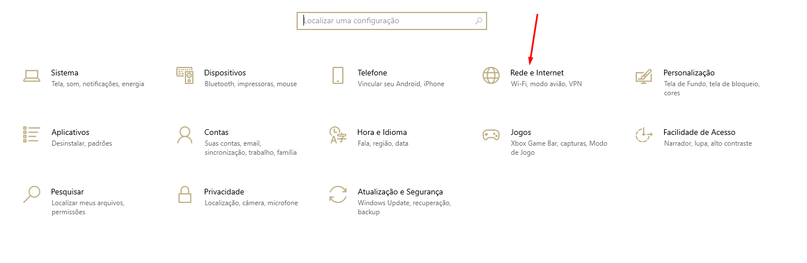  
<li> Em Status -> Propriedades</li>  
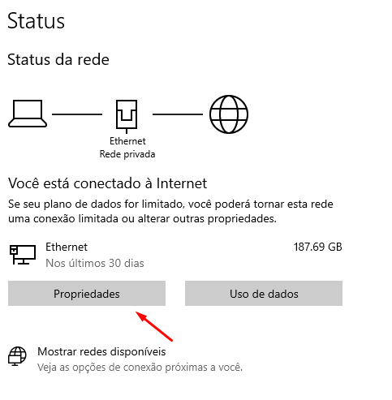  
<li> E verifique se a Configuração de ip está em automático:</li>  
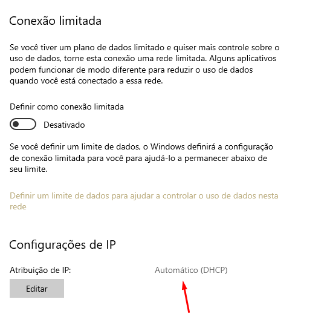  
<li>Se estiver automático fazer o seguinte:   
Clicar na tecla Windows e digitar cmd, vai aparecer isso:  
Clique em abrir.</li>
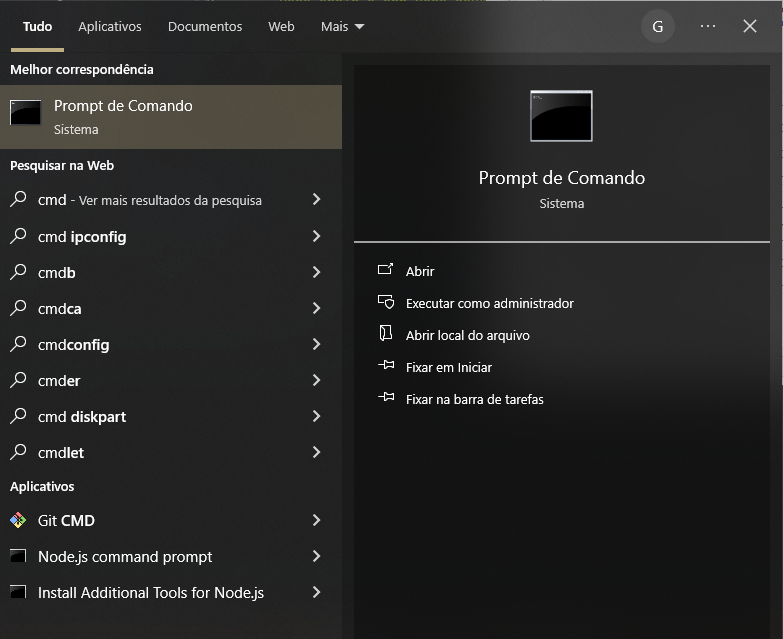  
<li> Depois de aberto, digitar o comando <b>IPCONFIG</b>:
  Vai aparecer essa tela, anote esse número, com os pontos, o IPv4.</li>
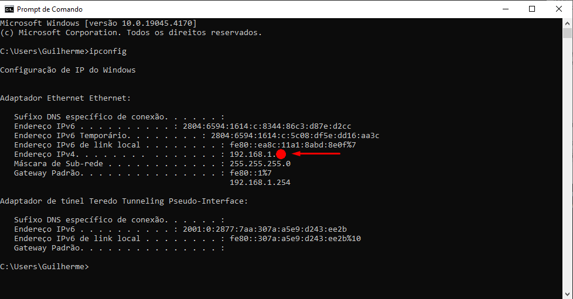 
<li> Depois de anotado o número ir emConfigurações -> Rede -> Status e clicar em <b>Alterar opções do adaptador</b></li> 
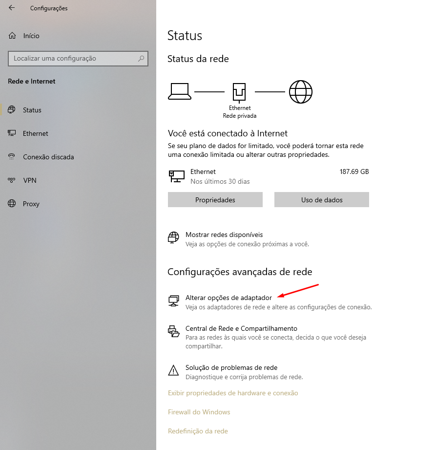 
<li>Clicando nele vai aparecer as opções de internet que o Computador está utilizando, clicar com o botão direito na opção que o computador estiver utilizando e clicar em <b>Propriedades</b></li> 
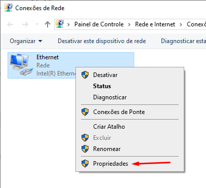
<li> Depois de clicado em Propriedades, procurar na tela o <b>Protocolo de IP versão 4</b> e clicar duas vezes nele.</li> 
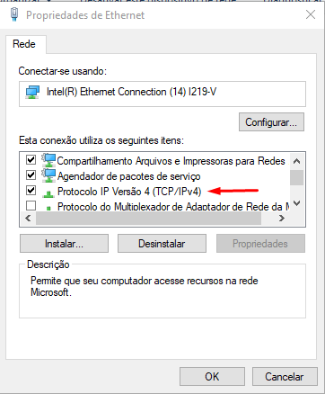
<li> Depois de aberto clicar em <b>Usar o seguinte endereço de ip</b> e colcoar o ip anotado anteriormente, porém, no lugar da bola vermelha, colocar .200 no campo <b>Endereço de ip</b>, depois de colocado é só apertar a tecla <b>TAB</b> no teclado e apertar em ok, ele vai preencher automáticamente o campo de baixo.</li> 
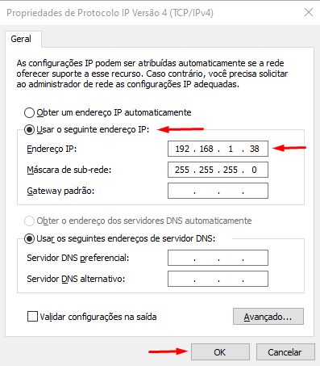 
<li>Depois clique em ok na janela de propriedade e feche a janela do adaptador</li> 
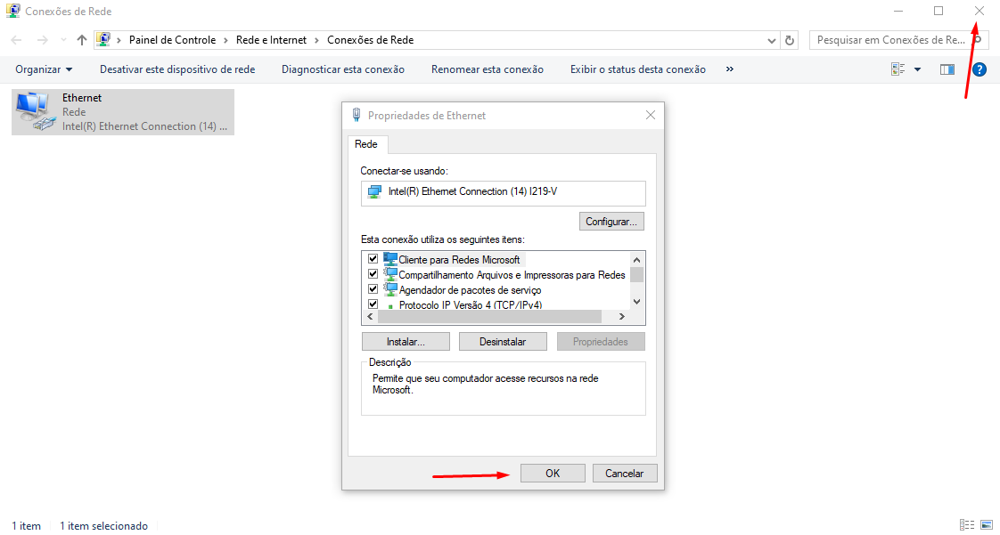
<li> Depois de fechado, clicar com o botão direito em <b>.htaccess</b> e clicar em <b>Abrir com</b> e escolher o bloco de notas, depois trocar o texto <b>ipcomputador</b> para o ip do computador fixado..</li>

>Você pode abrir os outros arquivos clicando com o botão direito e em <b>Abrir com...</b>, selecionando o bloco de notas, isso serve para os próximos arquivos que possam ser abertos mais para frente.
<li> Procure por duas linhas iguais à essa em <b>trocanome.php</b>: 

>//Troque essa linha de baixo:

<li> Troque a linha de baixo delas os textos "nomedopc", que é o nome do computador, e "caminhoarquivoFDBnosistema" para o arquivo do arquivo do FDB no computador, o mesmo que acessa o sistema.</li>

> exemplo, se o nome do computador for 'Servidor' e o arquivo FDB estiver na pasta 'C:/Astracon/Dados', irá ficar assim:   firebird:host=Servidor;dbname=C:/Astracon/Dados/NOMEDOSEUARQUIVOFDB.fdb;charset=utf8

<li> ir para o arquivo <b>serv.ps1</b> e trocar "caminhoparaapastadoserv" para o caminho da pasta que está o app, no caso a pasta 'appgarcom', e "ipdocomputador" para o ip do computador fixado.</li>

  

>>    terminado a instalação, agora:   Para fazer o app rodar você deve:

<li> Clicar com o botão direito no arquivo, ou atalho, do arquivo serv.ps1 e clicar em <b>executar com o powershell</b>, assim vai abrir uma janela azul ou preta, que é a janela de controle do app, você pode minimizar essa página.</li> 
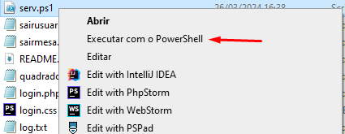

> Ele vai abrir assim:   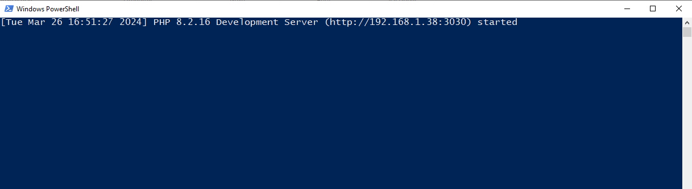

>não fechar essa janela, se fechar ela, o app não ai rodar.

  

>>    Para acessar o app você deve:
<li>Entrar em um navegador de sua preferência e colocar o ip do computador previamente configurado + ":3030"</li>

>Exemplo, se o IP do computador for: 192.168.1.50 colocar no navegador:   192.168.1.50:3030

>>  Pronto, o app já está no ar e você pode acessá-lo de qualquer dispositívo conectado
na mesma internet do computador que está rodando o app.
